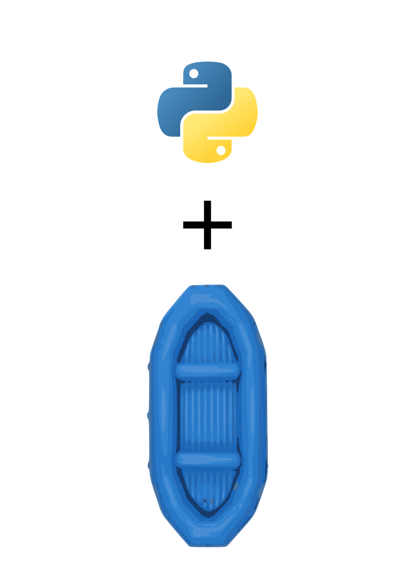
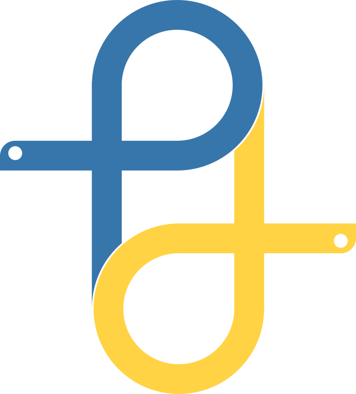
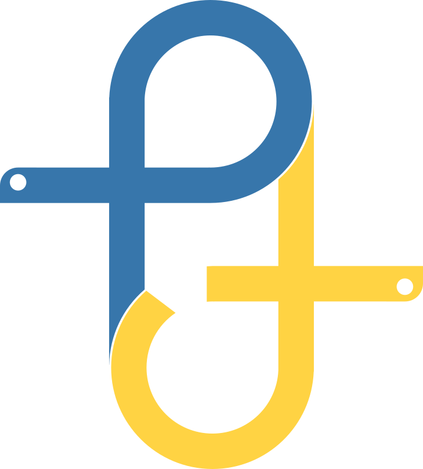

# PyTsada logo proposal by Eric

## Inspiration

Python logo and the top view of a river raft.

## Variation 1

This is just an abstract looking top view of a river raft colored with the Python logo colors. The heads of the Python logo is sticking out on the sides to represent rafting paddles. Also, the blue side is a "P", while the yellow side is supposed to be a small letter "t" but it looks like a "d" so...

## Variation 2

Same explanation as variation 1 but I removed some parts on the yellow side to make it look more like a "t" instead of a "d".

